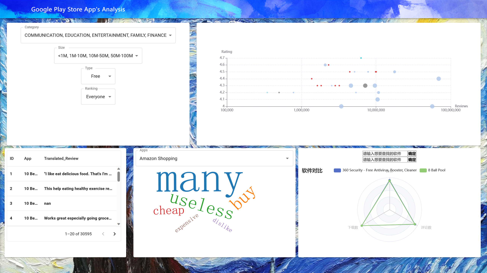

# 2023年浙江大学大数据可视化小组项目“谷歌应用商店app数据调查”
本仓库是小组共享工作的代码托管区.\
main-分支总项目.\
Dev-更新项目专用分支.\
axin-wxy修改的分支（source：Dev）.\
——待补充分支.\
建议每人一分支，合并至Dev上.\

使用说明：
先安装node.js及react相关文件（课上讲过）后开始如下操作
npm install \
npm install react-d3-cloud\
npm install @mui/material @emotion/react @emotion/styled\
npm install --save echarts-for-react\
npm install echarts --save\
npm install @mui/x-data-grid\
npm install @fontsource-variable/big-shoulders-stencil-text\
最后一步：npm start启动\
\
# 使用开源工具：
——————
- 框架：React 
- react-d3-cloud 
- Material UI  
- MUI X 
- ECharts 
- Canvas 

